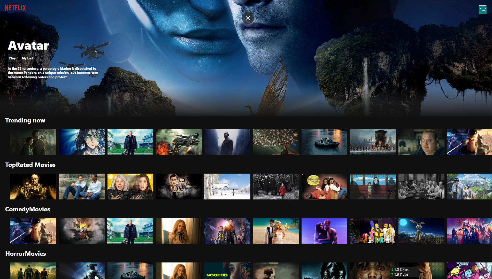

# *Netflix Clone*

>### Netlix Clone is web application that mimics the functionality and user interface of the popular streaming service Netflix.

<br>

## Tech Stack

**~** React, HTML, CSS, API, Firebase

<div>
<!-- html -->

<!-- css -->

<!-- js -->

<!-- react -->

<!-- firebase -->

<!-- github -->

<!-- vscode -->

</div>

<br>

## Demo

## [Live](https://link-url-here.org)

Insert gif or link to demo


## Installation

Clone the project using git
```bash
  git clone https://github.com/keshavop/Netflix-clone.git

```

Install node_modules with npm

```bash
  npm install
  npm start
```
    
## Screenshots





## License

[MIT](https://choosealicense.com/licenses/mit/)


## Appendix

Any additional information goes here

